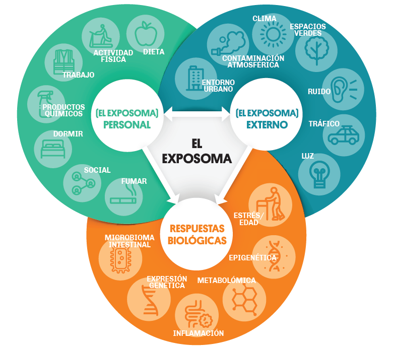

# ISGlobal.sesión4.Exposoma
## **Introducción al concepto del Exposoma y sus metodologías. Sesión 4 - Estrategias para el análisis de datos de Exposoma.**
  

**Alan Domínguez**, Investigador Predoctoral del Instituto de Salud Global de Barcelona - ISGlobal  
**Augusto Anguita-Ruiz**, Investigador Postdoctoral del Instituto de Salud Global de Barcelona - ISGlobal

El exposoma, descrito como **"la totalidad de las exposiciones ambientales humanas  desde la concepción en adelante"**, reconoce que los individuos estamos expuestos simultaneamente a multiples factores ambientales diferentes adoptando un efoque holístico para el descubrimento de factores etiológicos de la enfermedad. La ventaja prinicipal del enfoque del exposoma sobre otros más tradicionales "una exposición, una enfermedad" es que proporciona un framework para el estudio de múltiples riesgos ambientales (urbanos, químicos, estilo de vida, sociales, etc...) y sus efectos combinados. 

El **objetivo** de esta sesión es ofrecer una **introducción a los distintos abordajes estadístico**s necesarios para responder a las principales cuestiones de investigación en exposoma, por lo que esta sesión se :

**1.- Análisis descriptivo:**  En una primera parte de la sesión se trabajará sobre el concepto de análisis descriptivo en exposómica, mediante el cual se extraen las primeras conclusiones sobre los datos. Entre otros objetivos, el análisis descriptivo persigue identificar posibles valores anómalos, factores de confusión o variables que requieran de transformaciones previas al análisis. A su vez, el análisis descriptivo permite comparar preliminarmente los grupos experimentales objeto de estudio, estudiar los patrones de correlación existentes entre factores de exposición, e identificar fenómenos de agrupación en los datos (tanto a nivel de individuos como de características). Todos ellos, pasos imprescindibles para elegir el abordaje estadístico posterior más adecuado.

**2.- Análisis de asociación:** El análisis de asociación persigue la identificación de los posibles factores de exposición ambiental asociados con distintos parámetros de salud. En este bloque de la sesión se presentarán por lo tanto distintos abordajes analíticos holísticos centrados en el estudio de los efectos de múltiples factores de exposición y sus mezclas sobre la salud. Esto incluye principalmente modelos como el ExWAS (Exposome-Wide Association Analysis), u otros para el estudio de interacciones, o fenómenos de no linealidad (e.g., Bayesian Kernel Machine Regression). También se presentará una introducción a los métodos de clustering o mezclas de exposición (e.g., Weighted Quantile Sum Regression). Durante su estudio, se introducirán conceptos de gran importancia en el análisis del exposoma como son la selección de características o la corrección de testeo múltiple.

Para esta sesión práctica utilizaremos datos del estudio de exposoma HELIX. El estudio HELIX es un projecto colaborativo entre seis estudios longitudinales de cohortes de nacimiento basados en la población de seis paises Europeos (Francia, Grecia, Lituania, Noruega, Españana y Reino Unido).

 

**Nota:** Los datos proporcionados en este curso introductorio fueron simulados a partir de los datos de la subcohorte HELIX. Detalles del projecto HELIX y el origen de los datos colectados pueden ser consultados en la siguiente publicación: https://bmjopen.bmj.com/content/8/9/e021311 y website: https://www.projecthelix.eu/es.  

# Guía del repositorio
En este repositorio encontraras el código y los materiales usados durante la **Sesión 4 - Estrategias para el análisis de datos de Exposoma**. Para ayudarte a navegar por el repositorio, abajo se detalla su organización.

El repositorio contiene los siguientes documentos:

**1.- curso_exposoma_modulo_4.ipynb:** contiene el notebook para la sesión práctica con el código necesario para realizar el análsis de datos en proyectos de exposoma. 

**2.- data:** Esta carpeta contiene el **codebook** y los sets de **datos**, que seran utilizados durante la sesión.  

* Los **datos de exposoma (n = 1301)** que utilizaremos estan contenidos en un archivo Rdata, el archivo contiene los siguientes ficheros:

1. `phenotype` (outcomes)
2. `exposome` (exposiciones)
3. `covariates` (covariables) 

La descripción de cada variable (nombre, estructura, tipo de variable, transformacion, ...) esta detallada en el [codebook](https://github.com/alldominguez/ISGlobal.sesion4.Exposoma/blob/main/data/codebook.csv). 
   
**Nota:** Para unir las bases de datos es necesario utilizar la key variable **ID**. 

 

